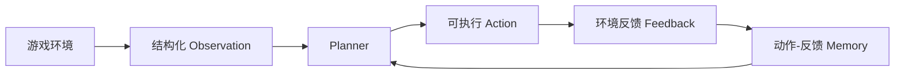
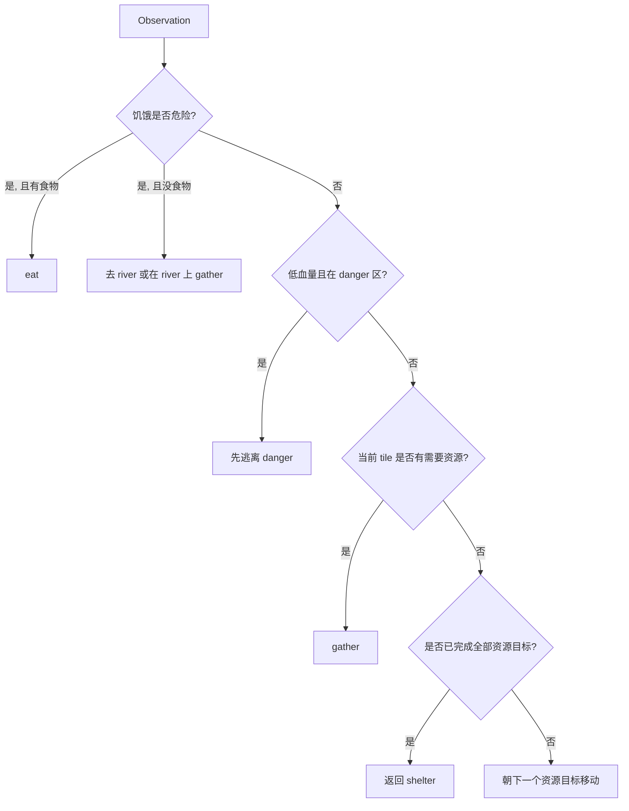
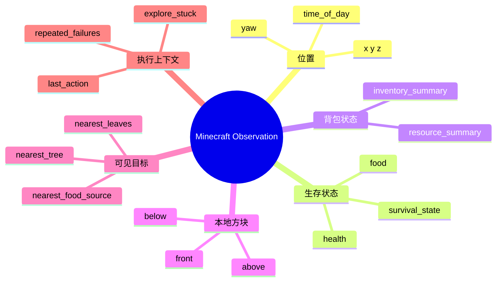
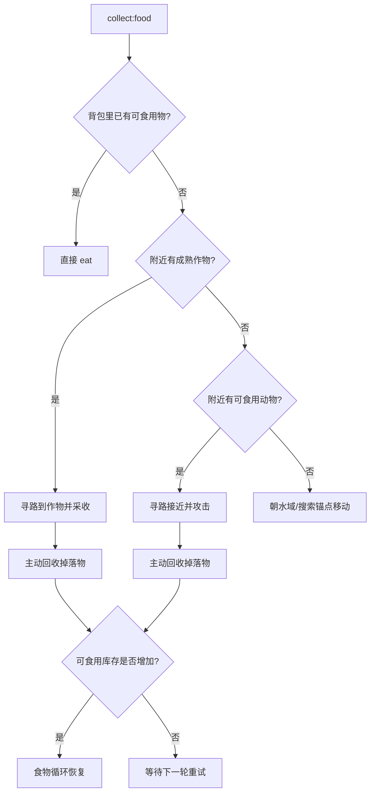
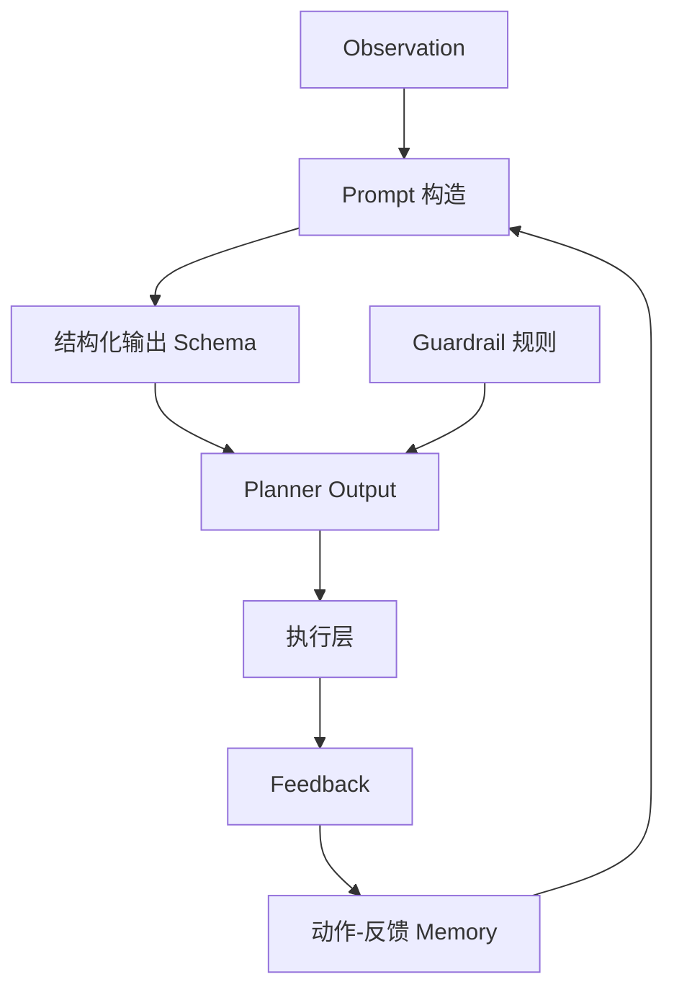
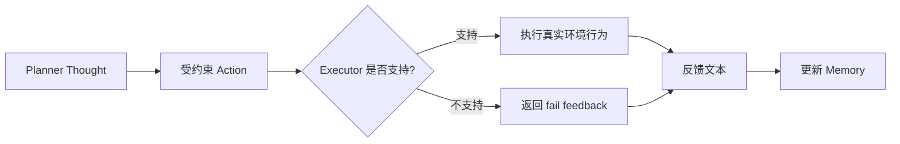
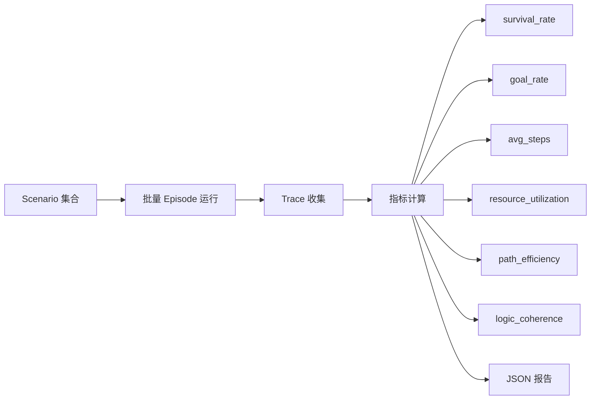

# 面试讲解图与执行链路说明

这个文件适合在面试中“边画边讲”或者“边展示 Mermaid 图边讲”。

## 1. 项目总闭环

当面试官问：
“你整体架构是怎样的？”

可以先用这张图。



### 讲解口径

“整个系统是一个闭环。环境先产生结构化 Observation，Planner 根据 Observation 和最近的 Memory 做决策，输出一个可执行动作，动作执行以后产生反馈，反馈再写回 Memory，影响下一轮决策。这是整个项目最核心的系统抽象。”

## 2. Grid-world 研究复现版

当面试官问：
“你最早那个可控环境版本怎么工作的？”

可以用这张图。

```mermaid
flowchart TD
    A[OpenWorldEnv] --> B[describe()]
    B --> C[Observation]
    C --> D[GameAgent.run_episode()]
    D --> E[Planner.plan()]
    E --> F[PlannerOutput thought+action]
    F --> G[env.step(action)]
    G --> H[success/failure + feedback]
    H --> I[SlidingMemory]
    I --> D
    H --> J[Trace Recorder]
    J --> K[Evaluator]
```

### 讲解口径

“Grid-world 版本里，我把复杂开放世界抽象成了一个可控环境。`OpenWorldEnv` 负责提供状态和执行动作，`GameAgent` 驱动主循环，Planner 输出 Thought 和 Action，执行结果写回 Memory 和 Trace，最后 Evaluator 对多轮 Episode 做统计评估。这个版本的作用是先把方法论验证清楚。”

## 3. Grid-world Planner 决策逻辑

当面试官问：
“Planner 实际上是怎么决定下一步动作的？”

可以用这张图。



### 讲解口径

“Planner 不是随便选动作，而是一个优先级驱动的决策过程。先处理生存硬约束，比如饥饿和危险区，再看当前 tile 能不能直接满足资源需求，最后才进入导航和长期目标推进。”

## 4. Minecraft 真实环境接入图

当面试官问：
“你是怎么把 Agent 接到真实游戏里的？”

可以用这张图。

```mermaid
flowchart LR
    A[Mineflayer Bot / Node.js] --> B[buildObservation()]
    B --> C[JSON stdin/stdout 协议]
    C --> D[planner_bridge.py]
    D --> E[Rule / OpenAI / LangChain 风格 Planner]
    E --> F[thought + action]
    F --> G[Node 执行层]
    G --> H[寻路 / 挖掘 / 吃东西 / 探索 / 收集]
    H --> I[status.json + events.jsonl]
    H --> J[Memory Tail]
    J --> D
```

### 讲解口径

“Minecraft 版本里，我把执行层和规划层拆开了。Node 侧通过 Mineflayer 控制游戏实体，负责状态提取、寻路、挖掘和吃东西；Python 侧只负责决策规划。两边通过 JSON line 协议通信，这样环境执行逻辑和 Planner 逻辑完全解耦。”

## 5. Minecraft Observation 结构图

当面试官问：
“Planner 在 Minecraft 里到底看到了什么信息？”

可以用这张图。



### 讲解口径

“我没有把 Minecraft 原始环境全部丢给模型，而是先做状态裁剪，只保留真正和决策相关的信息，比如位置、饥饿、库存、可见资源、最近失败历史等。这一步是保证 Planner 稳定性的关键。”

## 6. Minecraft 食物恢复链路

当面试官问：
“你现在的食物策略怎么运作？”

可以用这张图。



### 讲解口径

“现在的 `collect:food` 已经不是简单的‘去找食物’，而是一个分层资源恢复链。先吃现成食物，再优先收成熟作物，再追动物，最后把水域当成搜索锚点。关键是我把掉落物回收和库存确认也加进去了，所以不是‘走到附近就算成功’，而是尽量确认食物真的进了库存。”

## 7. LangChain 风格 Planner 图

当面试官问：
“LangChain 化之后具体改了什么？”

可以用这张图。



### 讲解口径

“LangChain 风格重构不是把整个项目推倒重来，而是只对 Planner 层做模块化升级。Observation 和 Memory 会进入更清晰的 Prompt 构造，输出被 Schema 约束，同时我保留了 Guardrail 规则来处理硬约束和安全逻辑。”

## 8. Planner 与 Executor 的契约关系

当面试官问：
“你怎么保证 Planner 输出一定能执行？”

可以用这张图。



### 讲解口径

“Planner 不直接调底层游戏 API，它只能输出一组受约束动作。执行层负责检查动作是否合法，然后运行具体逻辑。这样 Planner 和 Executor 的边界非常清晰，也方便后续替换模型或扩充动作集。”

## 9. 评测体系流程图

当面试官问：
“你怎么证明这个 Agent 是有效的？”

可以用这张图。



### 讲解口径

“我没有只看一个指标，因为开放世界 Agent 是多目标系统。除了任务能不能完成，我还关心存活率、效率、资源利用率和逻辑一致性，所以做了多场景、多指标的批量评测。”

## 10. 面试白板讲解顺序建议

如果你需要现场画图，建议按这个顺序讲：

1. 先画总闭环
2. 再讲 Grid-world 抽象
3. 再讲 Planner 优先级
4. 再讲动作-反馈记忆
5. 再讲 Minecraft 的规划层与执行层拆分
6. 再讲一个真实执行链路，比如 `collect:wood` 或 `collect:food`
7. 最后讲评测和项目收获

## 11. 一个具体执行链路示例

当面试官说：
“你给我讲一个完整例子。”

可以用下面这个食物恢复链路。

### 示例：Minecraft 中一次 `collect:food` 决策

1. Observation 显示：
   `food = 5`
   `inventory_summary` 中没有可食用物
   `nearest_food_source = wheat`
   `food_source_type = crop`

2. Planner 当前子目标变成：
   `restore food loop`

3. Planner 输出：
   `collect:food`

4. 执行层行为：
   寻路到成熟作物 -> 采收 -> 回收掉落物

5. 反馈写入 Memory：
   `collect:food -> success/fail: ...`

6. 下一轮 Observation 中：
   如果库存里的可食用物增加，Agent 就会更倾向于吃东西而不是继续冒险

### 讲解口径

“这个例子很好地说明为什么它是 Agent，而不是脚本。系统不是预先写死‘去收小麦’，而是根据当前饥饿值、库存、可见目标和最近失败历史，动态判断此刻最重要的是先恢复食物循环。”
